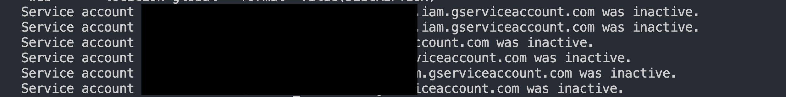

# Finding Unused Service Accounts in Your Google Cloud Project

Unused service accounts can pose a security risk to your Google Cloud project. By identifying and removing them, you can reduce your attack surface and improve your overall security posture.

Steps to Find Unused Service Accounts:

Enable the Recommender API:

[Enable the Recommender API](https://console.cloud.google.com/flows/enableapi?apiid=recommender.googleapis.com&redirect=https://console.cloud.google.com)

In the Google Cloud console, go to the APIs & Services page.
Search for "Recommender API" and click on it.
Click on the Enable button.

Install the gcloud CLI:

If you don't already have the gcloud CLI installed, install it by running the below command:

```sh
curl -sSL https://sdk.cloud.google.com | bash
```

Required roles
To get the permissions that you need to manage service account insights, ask your administrator to grant you the following IAM roles on the project that you want to manage insights for:

> To view insights: Ask your administrator to grant you the IAM Recommender Viewer role `(roles/recommender.iamViewer)`.

> To modify insights: You'll need the IAM Recommender Admin role `(roles/recommender.iamAdmin)`.

These predefined roles provide the necessary permissions. You can learn more about granting roles in Google Cloud's documentation on managing access to projects, folders, and organizations.

Permissions:

If you prefer to fine-tune permissions or use custom roles, here are the specific permissions needed:

Viewing insights:

`recommender.iamServiceAccountinsights.get`

`recommender.iamServiceAccountinsights.list`

Modifying insights:

`recommender.iamServiceAccountinsights.update`

You can achieve the same level of access using custom roles or other predefined roles that include these permissions.

Use the gcloud recommender insights list command:

Open a terminal or command prompt and run the following command:

```sh
gcloud recommender insights list --insight-type=google.iam.serviceAccount.Insight \
    --project=PROJECT_ID \
    --location=global
```

Replace your-project-id with the actual ID of your Google Cloud project.

Get only the list of service accounts

```sh
gcloud recommender insights list --insight-type=google.iam.serviceAccount.Insight \
    --project=PROJECT_ID \
    --location=global
    --format='value(DESCRIPTION)'
```



Review the output:

The command will output a list of all the service account insights for your project, including any unused service accounts.
Each insight will include information such as the service account name, the last used time, and the recommended action.
Take action:

For each unused service account, you can either delete it or disable it.
If you're not sure whether a service account is still needed, you can disable it first and then monitor it for any activity.
