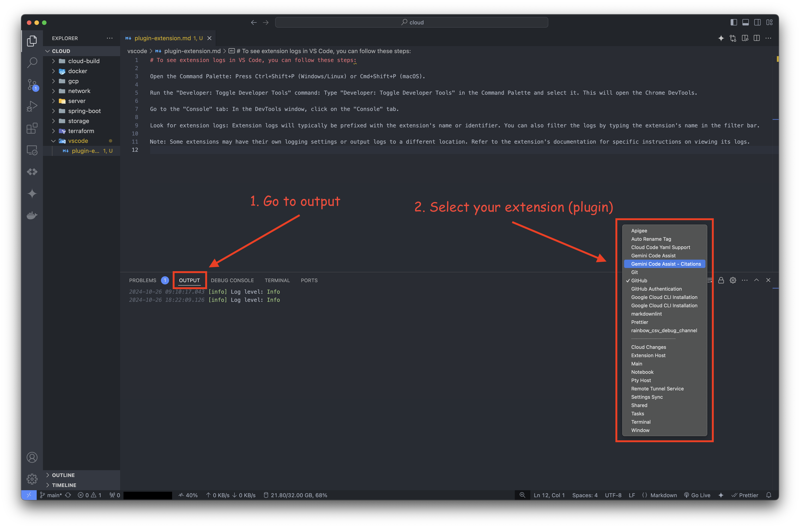
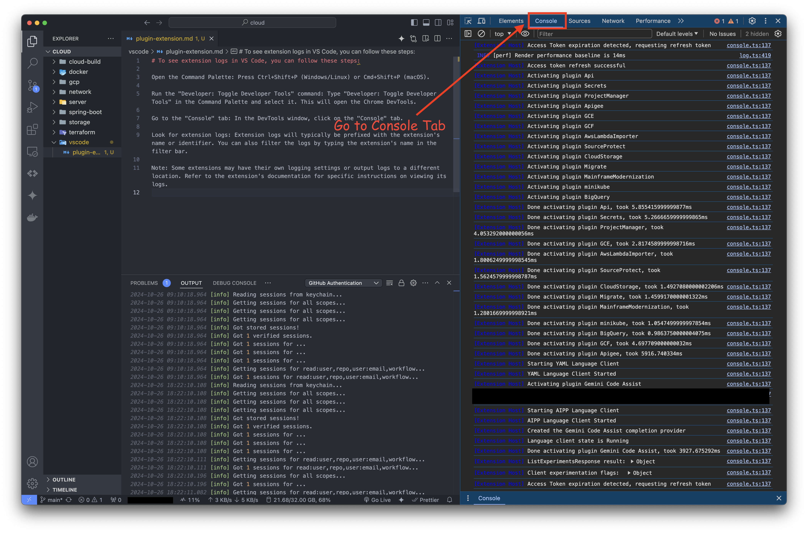

# To see extension logs in VS Code, you can follow these steps

## 🛠️ Method 1 - Using `Output` tab of terminal

`Step 1:` Open the terminal by pressing <kbd>Ctrl</kbd>/<kbd>Cmd + ~</kbd> or by going to `Terminal` --> `New Terminal` in the menu.

`Step 2:` In the terminal panel, select the `OUTPUT` tab.

`Step 3:` Use the dropdown menu on the right side of the panel to select the extension whose logs you want to view.

## 🖥️ Method 2 - Toggle Developer Tools

`Step 1:` Open the Command Palette: Press `Ctrl+Shift+P` (Windows/Linux) or `Cmd+Shift+P` (macOS).

`Step 2:` Run the `Developer: Toggle Developer Tools` command: Type `Developer: Toggle Developer Tools` in the Command Palette and select it. This will open the Chrome DevTools.

`Step 3:` Go to the `Console` tab: In the DevTools window, click on the `Console` tab.

`Step 4:` Look for extension logs: Extension logs will typically be prefixed with the extension's name or identifier. You can also filter the logs by typing the extension's name in the filter bar.

Note: Some extensions may have their own logging settings or output logs to a different location. Refer to the extension's documentation for specific instructions on viewing its logs.
